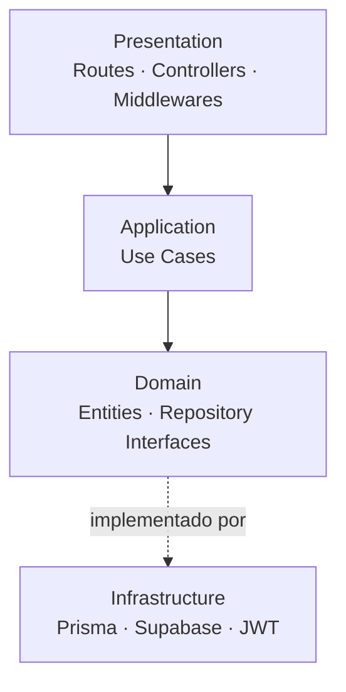
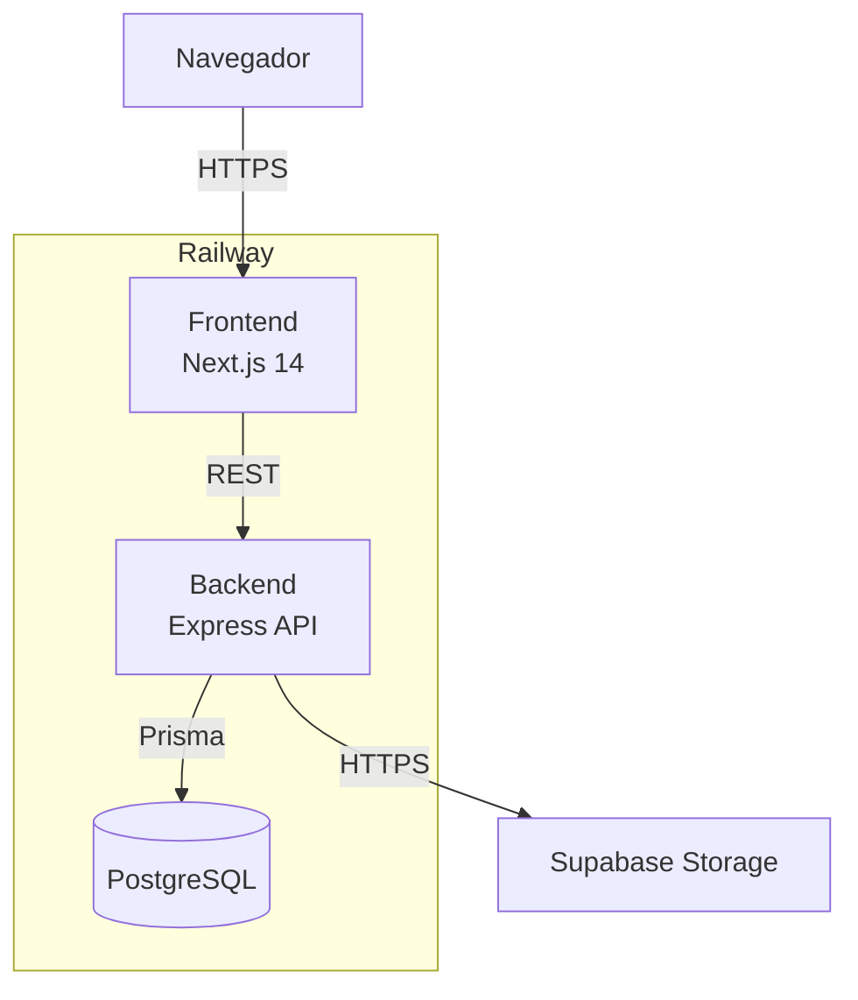
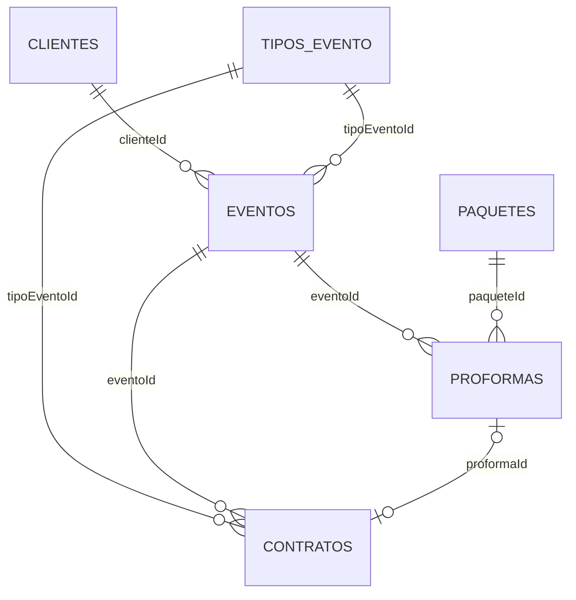
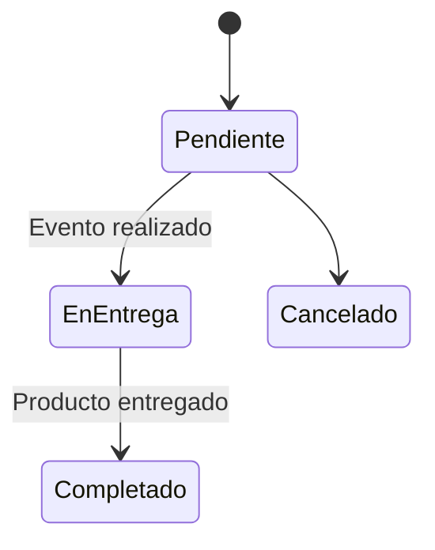
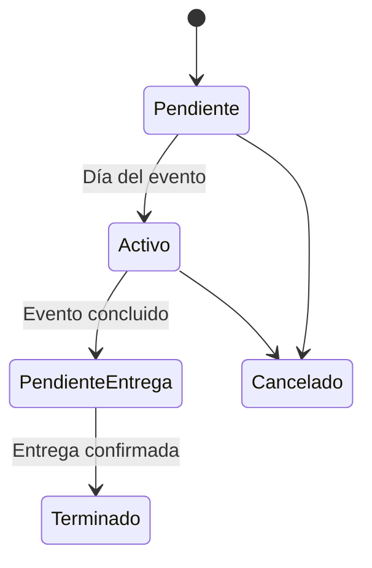
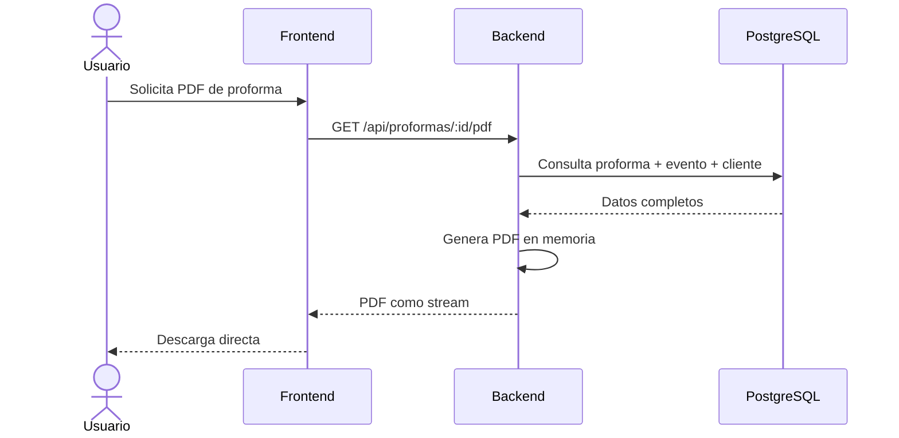
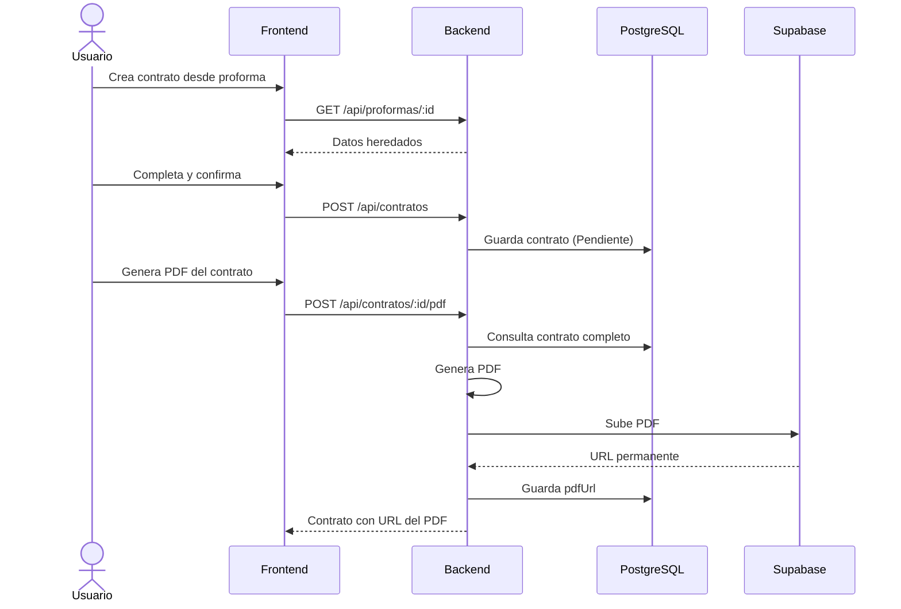

# Diseño Técnico — Gestor de Eventos

Documento de referencia técnica del proyecto. Cubre arquitectura de software,
arquitectura de despliegue, modelo de datos y las decisiones que los fundamentan.

---

## Stack tecnológico

| Capa | Tecnología | Versión | Justificación |
|---|---|---|---|
| Runtime backend | Node.js | 18+ | Mismo lenguaje en backend y frontend — un solo ecosistema que mantener |
| Framework backend | Express | 4 | API completamente desacoplada del frontend — si el negocio requiere una app móvil en el futuro, la misma API sirve sin modificaciones |
| ORM | Prisma | 6 | Migraciones automáticas y esquema tipado — los cambios en la base de datos se aplican con seguridad sin riesgo de pérdida de datos |
| Base de datos | PostgreSQL | 15 | Motor relacional open source, estándar en el ecosistema Node.js. SQL Server fue descartado por costo de licencia en producción y porque Railway provee PostgreSQL como servicio nativo sin configuración adicional |
| Framework frontend | Next.js | 14 | Renderizado en servidor — páginas más rápidas en conexiones móviles, relevante cuando el equipo consulta la agenda desde el celular en un evento |
| Generación de PDF | @react-pdf/renderer | latest | Los templates de proformas se construyen como componentes React reutilizables — modificar el diseño es editar un componente, no reescribir lógica |
| Almacenamiento de PDFs | Supabase Storage | — | Guarda los contratos firmados con URL permanente — el historial queda congelado exactamente como fue generado, independientemente de cambios futuros al template |
| Autenticación | JWT + bcrypt | — | Sistema privado con dos roles iniciales diseñados para ser extensibles — sin overhead de librerías externas para una aplicación de acceso interno |
| Despliegue | Railway | — | Conectas el repositorio y cada push a `main` despliega automáticamente. Rapidez y sencillez sin sacrificar estabilidad, a diferencia de Azure que requiere configuración manual extensa para proyectos nuevos |

---

## Arquitectura de software

El backend es un **monolito desplegable** — un único proceso, un único deploy.
Internamente aplica **Clean Architecture** organizando el código en capas con una
dirección de dependencia estricta: las capas internas no conocen las externas.

Esta combinación responde a la escala real del proyecto: un equipo reducido no justifica
la complejidad operativa de microservicios, pero sí justifica una arquitectura interna
que garantice mantenibilidad y extensibilidad conforme el negocio crezca.



**Regla de dependencia:** `domain` no conoce Prisma. `application` no conoce Express.
`presentation` no accede directamente a la base de datos.

---

## Arquitectura de despliegue

Railway gestiona los tres servicios del proyecto bajo un mismo panel.
Supabase Storage es el único servicio externo fuera de ese entorno.



Cada push a la rama `main` desencadena un deploy automático de ambos servicios.
El archivo `docker-compose.yml` incluido en el repositorio es exclusivamente para
levantar el entorno de desarrollo local — no interviene en el despliegue en Railway.

| Entorno | Base de datos | Deploy |
|---|---|---|
| Local | PostgreSQL vía Docker Compose | Manual |
| Producción | PostgreSQL plugin Railway | Automático desde `main` |

> Railway expone `DATABASE_PUBLIC_URL` para conexiones externas (desarrollo local)
> y `DATABASE_URL` para conexiones internas entre servicios (producción).

---

## Modelo de datos

### Relaciones



---

### `tipos_evento`

Catálogo de tipos de evento gestionado desde el sistema. Se relaciona tanto con
`eventos` como con `contratos` para mantener consistencia en el historial.

| Campo | Tipo | Descripción |
|---|---|---|
| `id` | String (cuid) | Identificador único |
| `nombre` | String | Nombre del tipo — ej: Boda, Quinceañera |
| `activo` | Boolean | Permite desactivar tipos sin eliminarlos |
| `creadoEn` | DateTime | Fecha de creación |

---

### `clientes`

Persona natural que contacta el servicio. Canal principal de comunicación: WhatsApp.

| Campo | Tipo | Descripción |
|---|---|---|
| `id` | String (cuid) | Identificador único |
| `nombre` | String | Nombre completo |
| `telefono` | String | Número de WhatsApp |
| `email` | String? | Opcional |
| `notas` | String? | Observaciones internas |
| `creadoEn` | DateTime | — |
| `actualizadoEn` | DateTime | Actualización automática |

---

### `eventos`

Fecha contratada con su cliente asociado. Un mismo cliente puede tener múltiples
eventos y el equipo puede cubrir varios simultáneamente el mismo día y hora.

| Campo | Tipo | Descripción |
|---|---|---|
| `id` | String (cuid) | Identificador único |
| `nombre` | String | Nombre descriptivo — ej: "Boda García - Castillo" |
| `fecha` | DateTime | Fecha y hora del evento |
| `clienteId` | String (FK) | Cliente que contrató el servicio |
| `tipoEventoId` | String (FK) | Referencia a `tipos_evento` |
| `estado` | Enum | Ver estados más abajo |
| `notas` | String? | Observaciones internas |
| `creadoEn` | DateTime | — |
| `actualizadoEn` | DateTime | — |

**Ciclo de vida del evento:**



---

### `paquetes`

Plantillas comerciales con valores predeterminados que agilizan la creación de proformas.
Al elegir un paquete, sus valores se heredan y pueden modificarse libremente antes de
confirmar la proforma. Los paquetes también pueden ignorarse — toda proforma puede
crearse desde cero.

Modificar un paquete no afecta las proformas ya generadas.

| Campo | Tipo | Default | Descripción |
|---|---|---|---|
| `id` | String (cuid) | — | Identificador único |
| `nombre` | String | — | Nombre comercial del paquete |
| `descripcion` | String? | — | Descripción visible al cliente |
| `incluyeFotografia` | Boolean | — | Servicio de fotografía incluido |
| `fotosIlimitadas` | Boolean | — | Sin límite de fotografías |
| `fotosDigitales` | Boolean | — | Entrega en formato digital |
| `fotosFisicas` | Boolean | — | Entrega en impresión física |
| `cantidadFotos` | Int? | `null` | Cantidad en decenas si no es ilimitada |
| `tipoPapel` | Enum? | `null` | BRILLO o MATE — solo aplica si es física |
| `incluyeVideo` | Boolean | — | Servicio de video incluido |
| `tiempoCobertura` | Int | — | Horas de cobertura |
| `incluyeMovilidad` | Boolean | — | Movilidad del equipo incluida |
| `personalCompleto` | Boolean | — | `true` = fotógrafo + filmador / `false` = un solo personal |
| `precio` | Decimal(10,2) | — | Precio base en Soles (PEN) |
| `activo` | Boolean | `true` | Permite desactivar sin eliminar |
| `creadoEn` | DateTime | — | — |

**Niveles disponibles:**

| Paquete | Perfil |
|---|---|
| **Recuerdo** | Un personal, cobertura corta, fotos digitales limitadas |
| **Cobertura** | Cobertura estándar, fotos digitales ilimitadas, opción de un personal o dos |
| **Producción** | Fotógrafo + filmador, cobertura extendida, fotos ilimitadas con opción física |

---

### `proformas`

Documento de cotización enviado al cliente por WhatsApp antes de confirmar el servicio.
Se genera como PDF al vuelo desde los datos almacenados — no se guarda el archivo.
Si el cliente necesita verlo nuevamente, el PDF se regenera idéntico en cualquier momento.

El PDF de proforma no se almacena porque es un documento de consulta cuyo contenido
puede reconstruirse fielmente desde la base de datos. Almacenarlo sería redundante.

| Campo | Tipo | Default | Descripción |
|---|---|---|---|
| `id` | String (cuid) | — | Identificador único |
| `eventoId` | String (FK) | — | Evento al que corresponde |
| `paqueteId` | String? (FK) | `null` | Paquete de origen si se creó desde uno |
| `incluyeFotografia` | Boolean | `true` | Fotografía incluida |
| `fotosIlimitadas` | Boolean | `true` | Sin límite de fotografías |
| `fotosDigitales` | Boolean | `true` | Entrega digital |
| `fotosFisicas` | Boolean | `false` | Entrega física impresa |
| `cantidadFotos` | Int? | `null` | Decenas — solo si no es ilimitada |
| `tipoPapel` | Enum? | `null` | BRILLO o MATE — solo si es física |
| `incluyeVideo` | Boolean | `false` | Video incluido |
| `tiempoCobertura` | Int | — | Horas de cobertura |
| `incluyeMovilidad` | Boolean | `false` | Movilidad incluida |
| `personalCompleto` | Boolean | `true` | Fotógrafo + filmador |
| `montoTotal` | Decimal(10,2) | — | Total cotizado en Soles (PEN) |
| `notas` | String? | — | Observaciones adicionales |
| `creadoEn` | DateTime | — | — |

> **Regla de negocio:** fotografía física ilimitada no está disponible.
> Si `fotosFisicas = true` entonces `fotosIlimitadas` debe ser `false`.

---

### `contratos`

Documento formal del acuerdo entre las partes. A diferencia de la proforma,
el PDF **se almacena permanentemente en Supabase Storage** — si el template cambia
en el futuro, el contrato original queda congelado exactamente como fue firmado.

Un contrato puede originarse desde una proforma — en ese caso hereda sus valores
como punto de partida, editables antes de confirmar. También puede crearse directamente
sin proforma cuando el acuerdo se cierra sin tiempo para cotizar previamente.

Los campos del evento (fecha, hora, dirección, tipo) se almacenan directamente en el
contrato como datos propios. Aunque esa información ya existe en `eventos`, su
desnormalización garantiza que el contrato refleje el acuerdo tal como fue firmado,
independientemente de ediciones futuras al registro del evento.

**Sección: datos del evento**

| Campo | Tipo | Descripción |
|---|---|---|
| `fechaEvento` | DateTime | Fecha del evento |
| `horaEvento` | String | Hora de inicio de la cobertura |
| `direccionEvento` | String | Dirección exacta |
| `tipoEventoId` | String (FK) | Tipo de evento contratado |

**Sección: servicio contratado**

Los mismos campos de fotografía y video que en `proformas`.
Si el contrato se origina desde una proforma, estos valores se heredan automáticamente.

**Sección: montos y pago**

| Campo | Tipo | Descripción |
|---|---|---|
| `montoTotal` | Decimal(10,2) | Total del servicio en Soles (PEN) |
| `montoAdelanto` | Decimal(10,2) | Adelanto recibido para separar la fecha |
| `metodoPago` | Enum | EFECTIVO, YAPE, TRANSFERENCIA |
| `cuentaPago` | String? | Número de cuenta o número de Yape |

El contrato especifica que al concluir el evento se cancela el saldo restante.

**Sección: firmas**

| Campo | Tipo | Descripción |
|---|---|---|
| `dniFotografo` | String | DNI del representante de la empresa |
| `dniCliente` | String | DNI del cliente que firma |
| `fechaContrato` | DateTime | Fecha de firma |
| `pdfUrl` | String? | URL del PDF en Supabase Storage |

**Cláusulas fijas incluidas en el PDF:**
- El adelanto no se reintegra por ningún motivo.
- Pasados 30 días desde la fecha del evento, no hay lugar a reclamo por pérdida
  o deterioro del material entregado o por entregar.

**Ciclo de vida del contrato:**



La transición a `Terminado` se habilita mediante un control simple que aparece
únicamente después de la fecha del evento, para no entorpecer el flujo operativo diario.

---

## Flujos de datos principales

### Generación de proforma al vuelo



### Creación de contrato desde proforma



---

## Enums del sistema

```
TipoPapel:      BRILLO | MATE
MetodoPago:     EFECTIVO | YAPE | TRANSFERENCIA
EstadoEvento:   PENDIENTE | EN_ENTREGA | COMPLETADO | CANCELADO
EstadoContrato: PENDIENTE | ACTIVO | PENDIENTE_ENTREGA | TERMINADO | CANCELADO
```