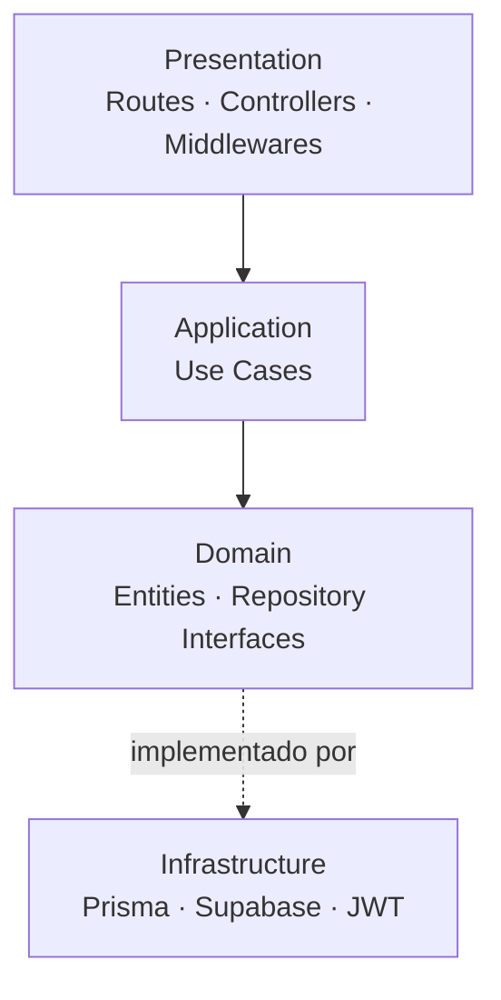
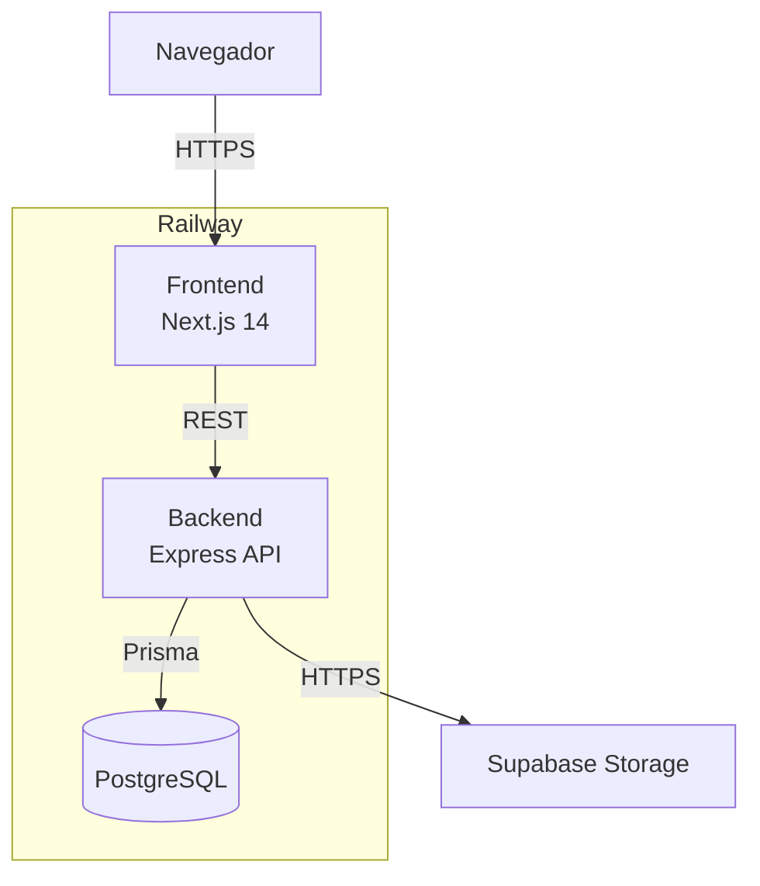
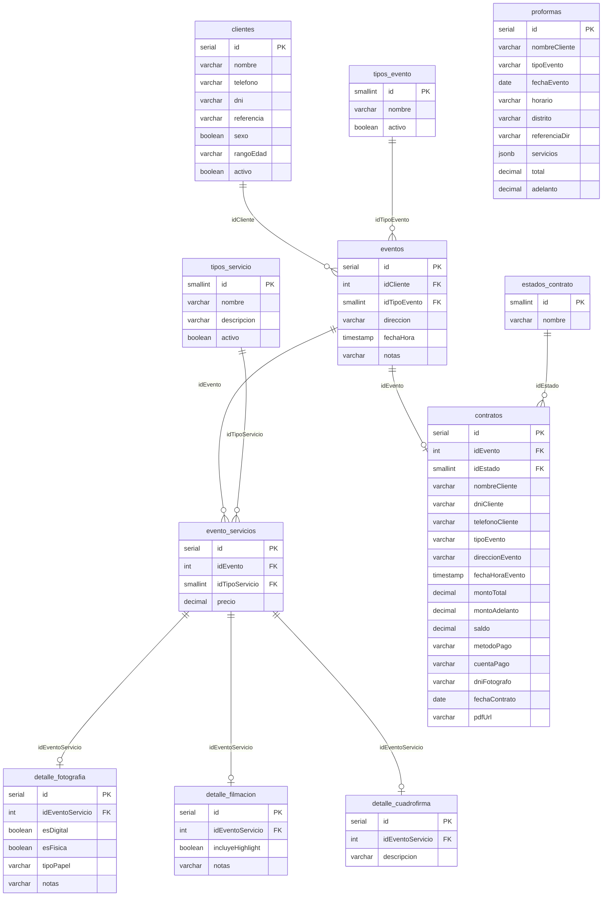
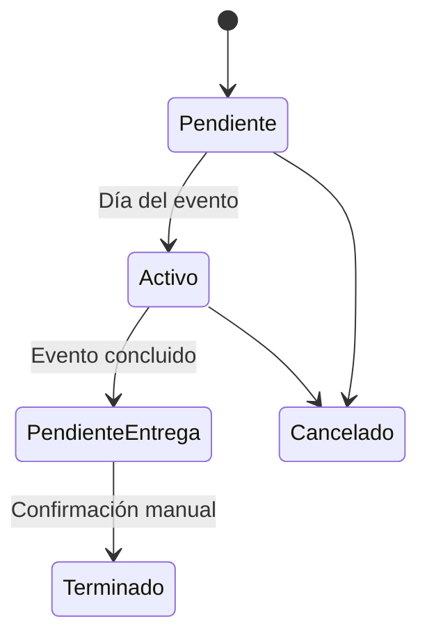
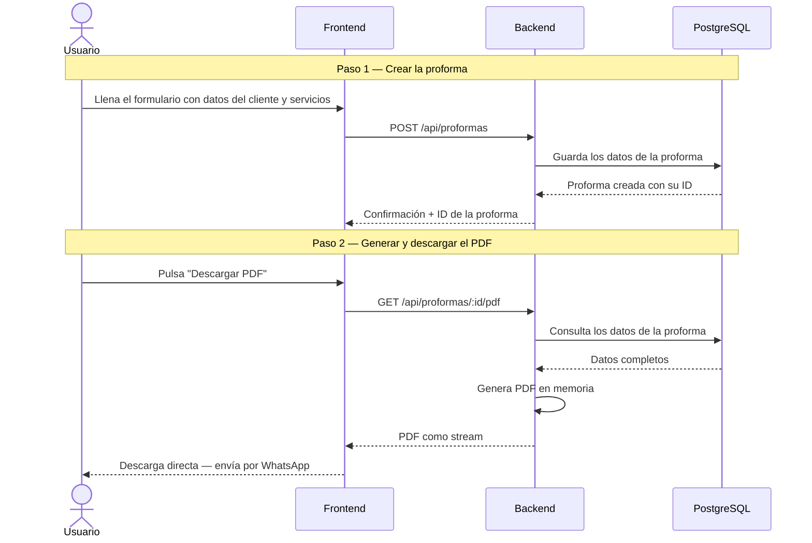
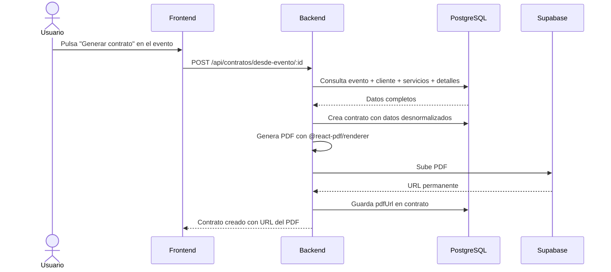

# Diseño Técnico — Gestor de Eventos

Documento de referencia técnica del proyecto. Cubre arquitectura de software,
arquitectura de despliegue, modelo de datos y las decisiones que los fundamentan.

---

## Stack tecnológico

| Capa | Tecnología | Versión | Justificación |
|---|---|---|---|
| Runtime backend | Node.js | 18+ | Mismo lenguaje en backend y frontend — un solo ecosistema que mantener |
| Framework backend | Express | 4 | API completamente desacoplada del frontend — si el negocio requiere una app móvil en el futuro, la misma API sirve sin modificaciones |
| ORM | Prisma | 6 | Migraciones automáticas y esquema tipado — los cambios en la base de datos se aplican con seguridad sin riesgo de pérdida de datos |
| Base de datos | PostgreSQL | 15 | Motor relacional open source, estándar en el ecosistema Node.js. SQL Server fue descartado por costo de licencia en producción y porque Railway provee PostgreSQL como servicio nativo sin configuración adicional |
| Framework frontend | Next.js | 14 | Renderizado en servidor — páginas más rápidas en conexiones móviles, relevante cuando el equipo consulta la agenda desde el celular en un evento |
| Generación de PDF | @react-pdf/renderer | latest | Los templates de proformas se construyen como componentes React reutilizables — modificar el diseño es editar un componente, no reescribir lógica |
| Almacenamiento de PDFs | Supabase Storage | — | Guarda los contratos firmados con URL permanente — el historial queda congelado exactamente como fue generado, independientemente de cambios futuros al template |
| Autenticación | JWT + bcrypt | — | Sistema privado con dos roles iniciales diseñados para ser extensibles — sin overhead de librerías externas para una aplicación de acceso interno |
| Despliegue | Railway | — | Conectas el repositorio y cada push a `main` despliega automáticamente. Rapidez y sencillez sin sacrificar estabilidad, a diferencia de Azure que requiere configuración manual extensa para proyectos nuevos |

---

## Arquitectura de software

El backend es un **monolito desplegable** — un único proceso, un único deploy.
Internamente aplica **Clean Architecture** organizando el código en capas con una
dirección de dependencia estricta: las capas internas no conocen las externas.

Esta combinación responde a la escala real del proyecto: un equipo reducido no justifica
la complejidad operativa de microservicios, pero sí justifica una arquitectura interna
que garantice mantenibilidad y extensibilidad conforme el negocio crezca.



**Regla de dependencia:** `domain` no conoce Prisma. `application` no conoce Express.
`presentation` no accede directamente a la base de datos.

---

## Arquitectura de despliegue

Railway gestiona los tres servicios del proyecto bajo un mismo panel.
Supabase Storage es el único servicio externo fuera de ese entorno.



Cada push a la rama `main` desencadena un deploy automático de ambos servicios.
El archivo `docker-compose.yml` incluido en el repositorio es exclusivamente para
levantar el entorno de desarrollo local — no interviene en el despliegue en Railway.

| Entorno | Base de datos | Deploy |
|---|---|---|
| Local | PostgreSQL vía Docker Compose | Manual |
| Producción | PostgreSQL plugin Railway | Automático desde `main` |

> Railway expone `DATABASE_PUBLIC_URL` para conexiones externas (desarrollo local)
> y `DATABASE_URL` para conexiones internas entre servicios (producción).

---

## Modelo de datos

El centro del sistema es la entidad `eventos`. Todo contrato se genera desde un
evento con un solo botón. La proforma es un documento independiente y desechable
sin relación directa con ninguna otra entidad.

Los detalles específicos de cada servicio se almacenan en **tablas propias tipadas**
(`detalle_fotografia`, `detalle_filmacion`, `detalle_cuadrofirma`). Esto garantiza
integridad referencial, validación a nivel de motor de base de datos y consultas
limpias para el módulo de análisis. Cuando se agregue un servicio nuevo en el futuro,
se crea su tabla de detalle correspondiente.

### Diagrama de relaciones



---

### `tipos_evento`

Catálogo administrable desde el sistema.

| Campo | Tipo | Descripción |
|---|---|---|
| `id` | SMALLINT (PK) | Identificador numérico |
| `nombre` | VARCHAR(100) | Ej: Boda, Quinceañera, Bautizo, Cumpleaños |
| `activo` | BOOLEAN | Permite desactivar sin eliminar |

---

### `tipos_servicio`

Catálogo de servicios que ofrece Miguel Producciones.

| Campo | Tipo | Descripción |
|---|---|---|
| `id` | SMALLINT (PK) | Identificador numérico |
| `nombre` | VARCHAR(100) | Ej: Fotografía, Filmación, Cuadro Firma |
| `descripcion` | VARCHAR(200) | Descripción breve |
| `activo` | BOOLEAN | Permite desactivar sin eliminar |

**Servicios iniciales:**

| id | Nombre |
|---|---|
| 1 | Fotografía |
| 2 | Filmación |
| 3 | Cuadro Firma |

---

### `estados_contrato`

| id | Estado | Descripción |
|---|---|---|
| 1 | Pendiente | Contrato creado, evento aún no ocurre |
| 2 | Activo | Día del evento |
| 3 | Pendiente de entrega | Evento concluido, producto en preparación |
| 4 | Terminado | Entrega confirmada manualmente |
| 5 | Cancelado | Contrato anulado |



La opción de marcar como `Terminado` aparece únicamente después de la fecha del
evento — un control simple que no interrumpe el flujo operativo diario.

---

### `clientes`

| Campo | Tipo | Descripción |
|---|---|---|
| `id` | SERIAL (PK) | Identificador autoincremental |
| `nombre` | VARCHAR(150) | Nombre completo |
| `telefono` | VARCHAR(30) | Número de WhatsApp |
| `dni` | VARCHAR(12) | Documento de identidad |
| `referencia` | VARCHAR(200) | Contexto de origen — ej: "Referido por García", "Facebook" |
| `sexo` | BOOLEAN | `true` = masculino / `false` = femenino |
| `rangoEdad` | VARCHAR(10) | `18-30`, `30-45`, `45+` — estimación para análisis |
| `activo` | BOOLEAN | `true` por defecto |

---

### `eventos`

Centro del sistema. Todo contrato se genera a partir de un evento.

| Campo | Tipo | Descripción |
|---|---|---|
| `id` | SERIAL (PK) | Identificador autoincremental |
| `idCliente` | INTEGER (FK) | Cliente que contrata el servicio |
| `idTipoEvento` | SMALLINT (FK) | Tipo de evento |
| `direccion` | VARCHAR(300) | Dirección del evento |
| `fechaHora` | TIMESTAMP | Fecha y hora de inicio |
| `notas` | TEXT | Observaciones internas opcionales |

Un mismo cliente puede tener múltiples eventos. El equipo puede cubrir varios
simultáneamente el mismo día y hora sin restricción en el sistema.

---

### `evento_servicios`

Tabla intermedia que registra qué servicios tiene cada evento y su precio.
Cada registro tiene su tabla de detalle correspondiente según el tipo de servicio.

| Campo | Tipo | Descripción |
|---|---|---|
| `id` | SERIAL (PK) | Identificador autoincremental |
| `idEvento` | INTEGER (FK) | Evento al que pertenece |
| `idTipoServicio` | SMALLINT (FK) | Tipo de servicio contratado |
| `precio` | DECIMAL(10,2) | Precio del servicio en Soles (PEN) |

---

### `detalle_fotografia`

| Campo | Tipo | Default | Descripción |
|---|---|---|---|
| `id` | SERIAL (PK) | — | — |
| `idEventoServicio` | INTEGER (FK) | — | Relación con `evento_servicios` |
| `esDigital` | BOOLEAN | `true` | Entrega en formato digital |
| `esFisica` | BOOLEAN | `false` | Entrega en impresión física |
| `tipoPapel` | VARCHAR(10) | `null` | `BRILLO` o `MATE` — solo si `esFisica = true` |
| `notas` | VARCHAR(300) | `null` | Observaciones adicionales |

> Fotografía física es siempre limitada — no existe fotografía física ilimitada
> como opción válida. La cantidad de fotos físicas se acuerda verbalmente y
> se especifica en las notas del contrato.

---

### `detalle_filmacion`

| Campo | Tipo | Default | Descripción |
|---|---|---|---|
| `id` | SERIAL (PK) | — | — |
| `idEventoServicio` | INTEGER (FK) | — | Relación con `evento_servicios` |
| `incluyeHighlight` | BOOLEAN | `true` | Video resumen del evento incluido |
| `notas` | VARCHAR(300) | `null` | Observaciones adicionales |

---

### `detalle_cuadrofirma`

| Campo | Tipo | Descripción |
|---|---|---|
| `id` | SERIAL (PK) | — |
| `idEventoServicio` | INTEGER (FK) | Relación con `evento_servicios` |
| `descripcion` | VARCHAR(300) | Descripción del servicio |

---

### `contratos`

El contrato se genera automáticamente desde el evento con un solo botón.
Al crearse, **desnormaliza** los datos del evento y del cliente — esto garantiza
que el contrato refleje el acuerdo exactamente como fue firmado, con independencia
de ediciones futuras al evento o al cliente.

El PDF se almacena permanentemente en Supabase Storage.

**Datos del evento** — copiados al momento de la firma

| Campo | Tipo | Descripción |
|---|---|---|
| `idEvento` | INTEGER (FK) | Referencia al evento de origen |
| `tipoEvento` | VARCHAR(100) | Copiado de `tipos_evento` |
| `direccionEvento` | VARCHAR(300) | Copiada del evento |
| `fechaHoraEvento` | TIMESTAMP | Copiada del evento |

**Datos del cliente** — copiados al momento de la firma

| Campo | Tipo | Descripción |
|---|---|---|
| `nombreCliente` | VARCHAR(150) | Copiado del cliente |
| `dniCliente` | VARCHAR(12) | Copiado del cliente |
| `telefonoCliente` | VARCHAR(30) | Copiado del cliente |

**Montos y pago**

| Campo | Tipo | Descripción |
|---|---|---|
| `montoTotal` | DECIMAL(10,2) | Total del servicio en Soles (PEN) |
| `montoAdelanto` | DECIMAL(10,2) | Adelanto recibido para separar la fecha |
| `saldo` | DECIMAL(10,2) | Monto restante a cancelar al finalizar |
| `metodoPago` | VARCHAR(30) | EFECTIVO, YAPE, TRANSFERENCIA |
| `cuentaPago` | VARCHAR(100) | Número de cuenta o número de Yape |

**Firma y estado**

| Campo | Tipo | Descripción |
|---|---|---|
| `idEstado` | SMALLINT (FK) | Estado actual del contrato |
| `dniFotografo` | VARCHAR(12) | DNI del representante de la empresa |
| `fechaContrato` | DATE | Fecha de firma |
| `pdfUrl` | VARCHAR(500) | URL del PDF en Supabase Storage |

**Cláusulas fijas en el PDF:**
- El adelanto no se reintegra por ningún motivo.
- Pasados 30 días desde la fecha del evento, no hay lugar a reclamo por pérdida
  o deterioro del material entregado o por entregar.

---

### `proformas`

Documento de cotización desechable, sin relación con ninguna otra tabla.
Se genera como PDF al vuelo y no se almacena el archivo. El campo `servicios`
usa JSONB por diseño deliberado — la proforma es un documento libre que debe
adaptarse a cualquier combinación de servicios sin restricciones de schema.
La validación de ese campo se aplica en el frontend.

| Campo | Tipo | Descripción |
|---|---|---|
| `id` | SERIAL (PK) | — |
| `nombreCliente` | VARCHAR(150) | Nombre — no es un cliente registrado aún |
| `tipoEvento` | VARCHAR(100) | Descripción libre del tipo de evento |
| `fechaEvento` | DATE | Fecha del evento |
| `horario` | VARCHAR(50) | Ej: "09:00 PM — 12:00 AM" |
| `distrito` | VARCHAR(100) | Distrito del evento |
| `referenciaDir` | VARCHAR(200) | Referencia adicional opcional |
| `servicios` | JSONB | Lista de servicios cotizados con sus precios |
| `total` | DECIMAL(10,2) | Total cotizado en Soles (PEN) |
| `adelanto` | DECIMAL(10,2) | Monto informativo de separación |
| `creadoEn` | TIMESTAMP | Fecha de creación |

**Estructura del campo `servicios`:**

```json
[
  {
    "nombre": "Fotografía Digital",
    "descripcion": "Fotos ilimitadas · Edición incluida",
    "entrega": "Link privado de descarga",
    "precio": 150
  },
  {
    "nombre": "Filmación Full HD",
    "descripcion": "Video editado · Highlight incluido",
    "entrega": "Link privado de descarga",
    "precio": 200
  }
]
```

---

## Flujos de datos principales

### Generación de proforma al vuelo



### Generación de contrato desde evento



---

## Enums del sistema

```
RangoEdad:      18-30 | 30-45 | 45+
TipoPapel:      BRILLO | MATE
MetodoPago:     EFECTIVO | YAPE | TRANSFERENCIA
EstadoContrato: Pendiente | Activo | PendienteEntrega | Terminado | Cancelado
```