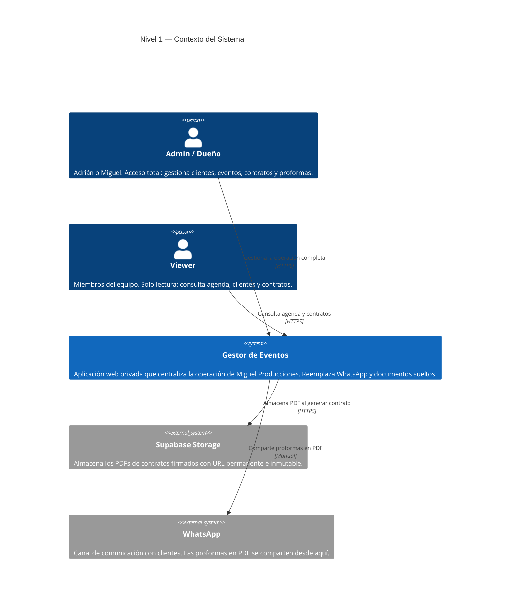
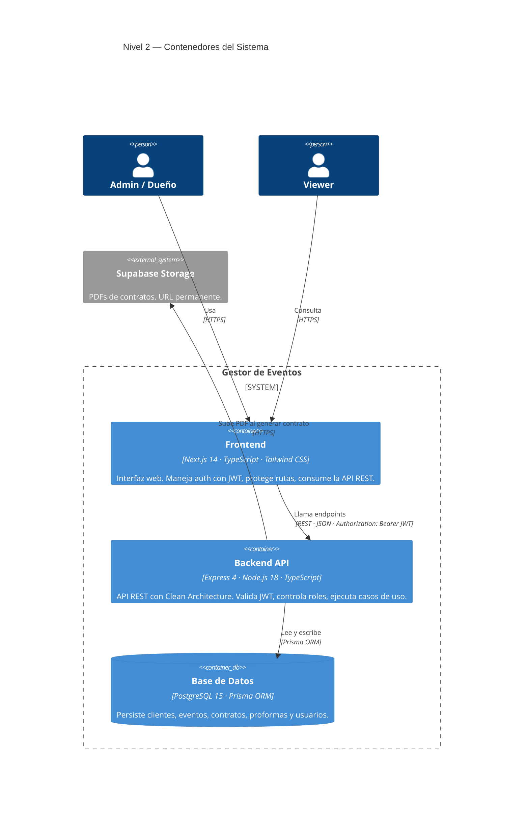

# C4 — Arquitectura del Sistema
## Gestor de Eventos · Miguel Producciones

Diagramas del sistema siguiendo el modelo C4 (Context → Containers → Components → Code).
Este archivo cubre los niveles 1 y 2. Los niveles 3 y 4 se agregarán por módulo según necesidad.

---

## Nivel 1 — Contexto del Sistema

Muestra quién usa el sistema y con qué servicios externos se relaciona.



---

## Nivel 2 — Contenedores

Muestra las aplicaciones y bases de datos que componen el sistema y cómo se comunican.



---

## Nivel 3 — Componentes (pendiente por módulo)

El nivel 3 desglosa los componentes internos de cada contenedor.
Se agregará por módulo según se vaya profundizando en el sistema.

### Backend — componentes internos (referencia)

```
Presentation Layer
├── Routes           → define los endpoints y los conecta con los controllers
├── Controllers      → reciben Request/Response, delegan al use case correspondiente
└── Middlewares      → authMiddleware (JWT), rolesMiddleware

Application Layer
└── Use Cases        → una clase por caso de uso (LoginUseCase, CreateEvento, GenerarContrato...)

Domain Layer
├── Entities         → tipos puros del negocio (Cliente, Evento, Contrato, Usuario...)
└── Interfaces       → contratos de repositorios (IClienteRepository, IEventoRepository...)

Infrastructure Layer
└── Repositories     → implementaciones Prisma de las interfaces del domain
```

### Frontend — componentes internos (referencia)

```
app/
├── (auth)/login     → página de login
└── (dashboard)/     → páginas protegidas (agenda, proformas, contratos, clientes, análisis)

context/
└── AuthContext      → estado global de auth: usuario, token, login(), logout(), puedeEditar

lib/api/
└── client.ts        → cliente HTTP que agrega el JWT automáticamente en cada request

middleware.ts        → protección de rutas a nivel de edge (Next.js middleware)
```

---

## Cómo usar estos diagramas

- Pegar el bloque `mermaid` en [mermaid.live](https://mermaid.live) para ver y exportar como PNG/SVG
- Compartir con una IA (ChatGPT, Claude) para generar una imagen del diagrama
- Los editores con soporte Mermaid (Notion, Obsidian, VS Code + extensión) los renderizan directamente
